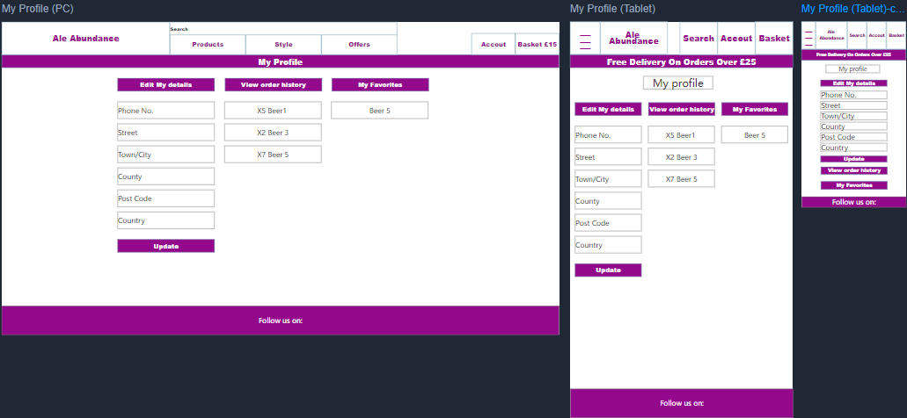
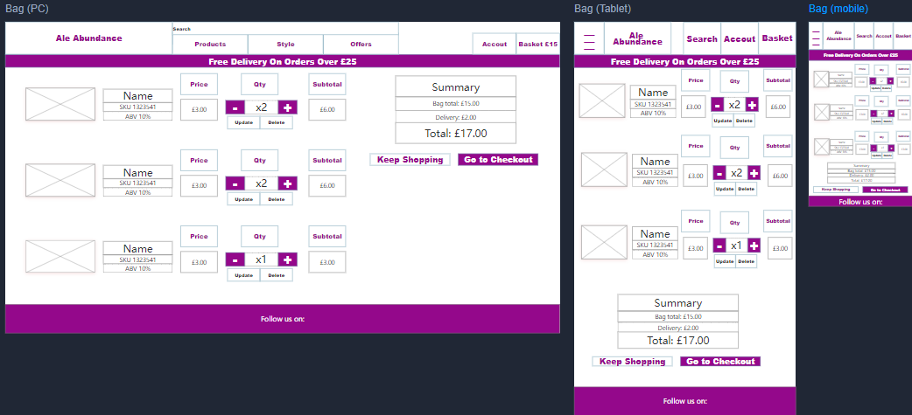
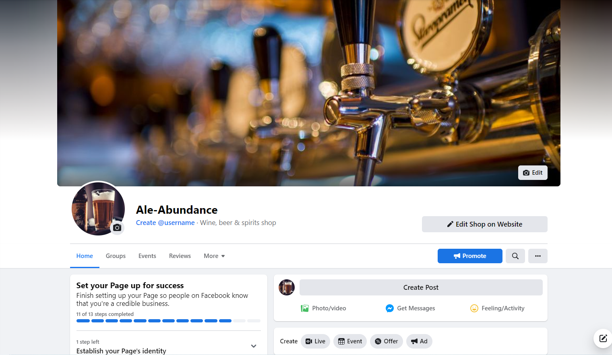

# Ale Abundance

- [Live Website can be found here](https://ale-abundance.herokuapp.com/)
- [Github Repository can be found here](https://github.com/jenns93/ale-abundance)
 # About
Explore a range of beers from across the globe!
This full stack e-commerce site have been built using a combination of: HTML, CSS, JavaScript, Python and Django. Ale-Abundance is a site for beer enthusiasts who can enjoy a range of products to purchase, information on individual products and on styles, and reviews from this website written by other registered users.    
## Table of Contents
 
- [User Experience UX](#user-experience-ux)

- [Structure](#structure)

- [Design](#design)
 
- [Wireframes](#wireframes)

- [Marketing](#marketing)
 
- [Features](#features)
 
- [Technologies Used](#technologies-used)
 
- [Testing](#testing)
 
- [Deployment](#deployment)
 
- [Bugs](#bugs)
 
- [Credits](#credits)

 
## User Experience UX
### Target Audience
-	Beer enthusiasts. 
-	People looking for products they cannot obtain from supermarkets.
-	People who want to try new flavours and styles

From the list of targeted audience, I decided to aim the websites styling and functionality towards these types of customers with the following:
-	Clear, large images of products to showcase all the vibrant colours and designs printed on them.
-	Displaying details on the ABV% (Alcohol by volume), name, style, country of origin, our rating, price, and description.
-	Recommending other products available by way of a (You may also enjoy) section below product detail pages.
-	Details and history on different styles as well as descriptions on each products taste is offered on the site to inform users on what to expect from these styles if they have never tasted any before.
-	Add to favourites function so that users do not need to remember the specific names of individual products.

### User Stories
 
i. As a customer I can see payment notifications so that I am informed on the success of my order purchase
 
ii. As a customer I can be informed with relevant notifications so that I can see when I have updated my basket 

iii. As a customer I can view basket total so that I can clearly see how much I my total order will cost
 
iv. As a customer I can filter items so that I can find products that I want with greater ease 

v. As a customer I can remove items so that I can delete items from my basket I no longer wish to purchase 

vi. As a customer I can select an item quantity so that I can purchase multiples of that product 

vii. As a customer I can view my basket so that I can clearly see the price & amount of products I have selected 

viii. As a customer I can go to checkout so that I can complete my purchase
 
ix. As an Admin I can edit products so that I can make necessary changes to product details
 
x. As an Admin I can delete products so that I can remove products that are no longer available for purchase
 
xi. As an Admin I can add new products so that I can expand my product range 

xii. As a customer I can view specific details of a product so that I can make more informed purchases

xii. As a User I can bookmark products to a list so that I can view my favourite products and purchase them quicker

xiv. As a User I can write a review on a product so that I can inform other users on my thoughts on the product

xv. As a User I can remove favourites so that I can remove any product I have previously saved to my favourite list that I do not like anymore

xvi. As a User I can rate a product so that I can rate the product to accompany my review
 
### Scope
Feature to be included to achieve user needs and meet the business goals are as follows:
-	Clear and simple site navigation via navigation bar and links.
-	Home page with a direct link to all products via 'shop beer' button to immediately begin shopping.
-	X1 Add to basket button available directly from product list making it easier for customers looking to by a selection of beer to try.
-	Product detail pages with ratings and descriptions of what to expect from the product along with other users reviews and ratings. 
-	Add to favourites button via ‘product detail’ page and favourites list (with x1 add to basket) via ‘my favourites’ page available to registered users for faster purchase of their favourite products.
-	My profile page provides a space where registered customers can view and edit/update their delivery details anytime. Also order history is available to view from this page.
-	Register/sign up page available that will send user a verification link via email so they can activate their account to user the full amenities of the site.
-	Sign in/Logout pages provided to allow the user to come and go as they please.
-	Prefilled delivery from available via checkout if user is registered and has either previously made a purchase and saved details or has filled in the form via ‘my profile’ page.
-	Custom 404 page with links to return home. 

## Structure
### Database

I have connected to the Heroku Postgres database add-on which has been used for the sites app models. This entity-relationship diagram displays how the models relate to one another.

#### Profiles
With this app authenticated users can save delivery information to enable the order form to be pre-populated with their information, saving time and giving the user a more pleasant experience with their purchase. A one-to-one field has been used for the User Profile model this is linked to the Django All AUTH user account. The model method 'create_or_update_user_profile' runs when logging in making the profile if it doesn't exist in the model already.

#### Products
Products app dictates products that display on the site.
With Products single items can be added to the database for them to become a purchasable product on the site. Admin users alone have ability to use this functionality, this can either be done in the admin panel or from the product management link in the navbar which uses the add_product view. With one Foreign Key the model relates to the category model. 
The Category model holds all the categories of the beverages available, allowing users the ability to view a filtered list of products based on category.
Review product model enables users to write a review on a product, holding the product and user information along with the content of the review and star rating. 

#### Checkout
Order and Order Item are used in the checkout app allowing the user to purchase items for sale on the site.

Holding all the data of the users basket, Order Item has a foreign key for Product and Order. This model also retains the quantity of items for each product along with a total. This is used to calculate the total sum of the purchase. The product Foreign Key uses on_delete=models.CASCADE, the 'original basket' field allows the admin to see the original purchase.

The Order model holds shipping information and billing information as well as containing data for the stripe PID. The Boolean order_success updates when a purchase is successful and every order automatically generates a new order number.

#### Home
The Contact model holds data for users to submit custom issues they have that the FAQ cannot solve, this model asks for their name, email, issue type and issue details. Issue type is a integer field allowing users to choose one of five options for their issue allowing the admin to have a more cohesive list of issues broken down into type. 

## Design
 
### Colour Scheme
- Colour scheme is white / black / light grey #f1f1f1 / purple rgb(122, 15, 143) for a vibrant clean look.
### Imagery
- Image of draught taps slightly out of focus welcomes users on the landing screen adding a modern but classic aesthetic.
- Superusers can upload images of new products via product management page.
- A placeholder image is provided for products not assigned their own image.
- Products images appear throughout the site at various sizes in product list/detail/checkout/bag updates.
 
## Wireframes
- The wireframes were created using [Mockplus](https://www.mockplus.com/)
 
### Home Page

### Products

### Profile page

### Product Detail

### Bag

 
## Marketing
### Plan
-	Ale-Abundance is a B2C (business to customer) e-commerce website selling a range of beers with detailed information and reviews. 
-	A Facebook page was created to showcase details of what the site provides and updates on related news concerning products and the site.

-	User can subscribe to our newsletter, using Mail Chimp via the footer on all pages.

### SEO’s

To decide on what phrases and keywords to use across the website I conducted SEO (Search Engine Optimization) research by Googling relative words associated with my site to see the kinds of websites Google returned. Doing so allowed me to narrow the scope of what keywords would serve my purpose.
- ale, beer, pale ale, stout, IPA, pilsener, wheat beer, lager, online, buy beer now, real ales, order beer online, buy beer online (These returned the best results relevant to this site)

## Features
### Home

- Users are greeted on the home page with navigation to all areas of the site as dropdown menus, this is carried though the entirety of the site.
- From here users can access login and sign-up options along with access to their profile if they have already logged-in.
- User also have dropdown menus for viewing the available products in price/ABV order along with others.
- On mobile view the navbar is compressed to allow for ease of use.

- Alternatively, user can view a full list of products easily by clicking the ‘shop beer’ button.
 - Users can also click the ‘explore’ button which will revel tabs with information on the different types/styles of products available along with a brief description and history on the style.
 
### Products

- All users will view the products page with a list of available products based on their choices on how to view the products for example viewing a particular style of beer or price order.
- Users view of the products is in the form of each product occupying its own box with the product image and details on the product style/ABV/Origin and price.
- User can select the product images to be taken to the details page for the desired item.
- User also have the ability to quickly add single items to their basket by clicking the ‘x1 add’ button.
- Upon adding any items to the basket, users are greeted with a popup message referencing the changes to their basket, this can be dismissed by clicking the ‘X’ button.   
- On mobile view the product list is stacked to allow for better use.

### Sign Up
- Users will be prompted to create an account by filling in a short form.
- Users will be required to provide an email address, username, and password.
- When the form is completed, users can select "Submit" where they will be redirected to the home screen allowing them to now access the ‘my profile’ page and the ability to now save products to favourites/write reviews and gain access to special prices.
- A notification bar will appear on home page briefly to confirm Sign up successful.
- An email will be sent to user as confirmation of creating their account.
 
### Login
- Users will be asked to provide their username and password.
- When required fields are completed the user can select "login" to gain access to ‘my profile’ page and the ability to now save products to favourites/write reviews and gain access to special prices.
- A notification bar will appear on home page briefly to confirm login.

### Log Out
- Users will be asked if they are sure they would like to "Log Out" once before logging out is completed and will then be redirected to the home page.
- A notification bar will appear on home page briefly to confirm logout.
 
### Profile

- On profile page users can click the dropdown link for delivery details to view and update delivery details and then save.
- User can also view their order history which is revealed by clicking the dropdown. This displays previous purchases with order reference number/price/quantity etc.

### Product Details

- Product details pages consist of: Product image / style / name / ABV / origin / price / star rating and a brief description and background on the product.
- Users can select a quantity to add to their basket either with the plus/minus buttons or by typing in the desired amount then selecting ‘Add to basket’. This will prompt the bag notification with an update on the user’s current bag contents.
- A ‘Back’ button is provided which will return the user to the products screen.
- On mobile view the product details are stacked to allow for better use.

 - The user will also be provided with a header of ‘you may also enjoy’ where below will be 4 other products listed in smaller cards. These can be selected to take the user to product page of that product.

 - Registered users also have the ability to save any product to their favourites by selecting the bookmark tab.
 - Also registered users have an option to write a review on products where they will fill out a short form with their thoughts on the item, once submitted a chain of other reviews on the product will be displayed below the product detail.

### View Basket

- User can select the basket icon to take them to the bag page where all their current items will be displayed.
- The contents list will refer product images/name/ABV/SKU/quantity and subtotal.
- Users will have the option to change the quantity of each product in their basket, one the desired amount has been selected users can click the ‘update’ button to update the page on their changes.
- Users will also have the ability to delete any item from the list by selecting the bin icon which will ask if they are sure they wish to delete, one confirmed the item will be deleted from the page and the order total updated.
 - Users will be show a price breakdown on their order showing them subtotals of each product along with a collective total/delivery charge and grand total.
- Users will also be shown how much more they need to spend to be eligible for free delivery in the order summary section.
- In the order summary section users have two options, either to keep shopping or head to the secure checkout where they will complete their order.

### Checkout

- The checkout page will show a short summary of the users order with product image/name/quantity and subtotal prices along with the order total/delivery charge and grand total.
- The users will need to the fill in the delivery form where they must fill the required fields for their delivery information.
- User delivery information is already pre-filled if the user has an account and have provided and saved the details previously.
- Users will be required to provide a valid credit/debit card before order completion, after this they can select ‘complete order’ where if successful a loading overlay will display then displaying a order summary along with a notification of completion.
- If orders are not successful then users will be returned to the checkout form to change or complete any offending fields, user are made aware of which fields are causing the issue.

### Adding Products
- Superusers can access the ‘Product management’ dropdown tab on the user icon, this will take them to the add product page.
- Superusers will provide all details on the product including a SKU number and price, an image is not required as a ‘no image’ image is provided as default (this can be updated at any time via edit product option on product detail).
- Once all fields are completed and the superusers is happy, they can confirm and submit the product by selecting ‘Add product’
 - Alternatively, a ‘cancel’ option is provided returning them to products page.

### Editing Product
- Superusers can access the edit product page via any products product details page where a pencil/paper icon will be displayed.
- Superusers are brought to the edit form where they can then change any details within the form, along with adding or changing the products image.
- Once the superusers is satisfied with the changes, they can confirm by submitting the changes by selecting ‘Update product’.
- Alternatively, a ‘cancel’ option is provided, returning them to products page. 

### Deleting Product
- Superusers can access the delete product page via any products product details page where a bin icon will be displayed.
- Superusers are brought to the delete confirmation screen form where they can confirm they are sure they wish to delete the product.
- Alternatively, a ‘cancel’ option is provided, returning them to products page.  

### Reviews

- Registered users when viewing a product details page have the option to fill out the review form and submit their own review and thoughts on the product.
- Once their review is submitted the users will be notified that their review was successfully posted.
- The user’s review will now be visible to other site users and will be added to the string of reviews below the original comment.
 
### Favourites

- Registered users will have to save any product to their favourites by clicking the bookmark icon.
- Registered user will then be notified that the product has been added to their favourites along with the bookmark icon changing colour.
- Registered users can un-favourite products anytime by clicking the bookmark icon again, this will prompt a notification showing that the product has been removed from the users’ favourites.
- Registered users can view a list of their favourites via their ‘my favourites’ page where they can get quick access to their desired products, items can be removed from the favourites list from here as well by un-clicking the bookmark icon.

### Categories
- Users will be presented with a category dropdown menu with all options such as price/Abv/rating to filter by.
- Users can also select the displayed style on an individual product tag to filter by the desired style.

### Search

- Users can type anything into the search bar and will then be brought to their results.
- If nothing matches the users search query then they will be told so with a message starting so. 

### Footer

- Footer displays all available social links at the base of all pages.
- Selecting these links will take the users to the desired site in a new browser tab.
- Footer will also display link to FAQ page and a contact us page.

### FAQ 
- User will find a list of frequently asked questions with the relevant answers to help the will general queries.

### Contact Us
- The contact us page to allow users to contact the admin with more detailed issues.
- Users are asked to provide their name, email, issue type (from list), and issue details where they can explain exactly what their issue is.

### Future Features
- Email registered users will monthly deals and offer.
- Extended range of products.
- Subscription to beers of the week/month.
- Gift packs for occasions (Birthdays/Father’s Day/Christmas/etc) 
- Articles from breweries & critics.
- Virtual assistant bot to help with more specific issues customers may have.
- Promo codes for discounts.

## Technologies Used
 
### Languages Used
 
- Python
- JavaScript
- Django
- HTML
- CSS
 
### Frameworks, libraries, and programs used
 
- [Heroku](https://dashboard.heroku.com/apps) Heroku was used to host the files and to publish the finished program.
- [Django](https://www.djangoproject.com/) Django was used to develop this site with its built in framework.
- [Gitpod](https://www.gitpod.io/) Gitpod was used to code the website and commit changes throughout the development to Github.
- [Bootstrap](https://getbootstrap.com/) Bootstrap was used for structuring the design of html templates.
- [AWS](https://aws.amazon.com/) Amazons aws was used to store the static images & files.
- [PostgreSQL](https://www.postgresql.org/) PostgreSQL was used as the database with Heroku.
- [Mockplus](https://www.mockplus.com/) Mockplus was used to create the wireframes for this site.
 
## Testing
 
### Functionality Testing
 
i. Navigation bar
- All navigation links have been tested on all pages to ensure they direct the user to the desired page.
- Search bar has been tested with a variation of data e.g., numbers, unrelated words, symbols, and blank field. All returning the closest matches or informing the user that no product matches the search.
- Category links within the navbar have been tested and are returning the correct sorting/filtering functions.
 
ii. Authorisation pages
- Sign up page has been tested by attempting to use already used emails and usernames as well as non-matching passwords and un-satisfactory passwords, all returning the users to the same page notifying them on the offending field.
- Login page has been tested by attempting to use unregistered usernames as well as incorrect password this returns the user to the same page notifying them on the offending field.
- Sign out page buttons 'cancel' and 'Sign out' have been tested and either return the user to the home page with a notification that they have signed out or cancel the sign out and return the user still logged in.
 
iii. Products
- Products page has been tested on various screen sizes to ensure the item card stacks correctly based on the device being used.
- The ‘Add x1’ to basket has been tested on all products and always adds one single of the chosen product to the basket, the basket notification reflects the update correctly.
- Sorting of products by price(high-low), price(low-high), rating(high-low), rating(low-high), ABV (high-low), ABV (low-high), name(A-Z), name(Z-A), Category(A-Z), Category (Z-A) have all been tested and return desired results. The ‘all products’ dropdown with these filters returns the same correct filtered lists.
- Selecting ‘style’ categories have been tested and return a filtered list of products within the chosen category, the ‘<all’ button has been tested as well and returns the user to the original all products view.
- The back-to-top button returns the user to the top of the page as designed.
- The style tags on the product card have been tested and return a filtered list of the style selected.
- The products showing total always reflects the correct count of products in any filtered list.      
 
iv. Profile
- The profile page has been tested by updating all fields of the ‘edit default delivery info’ form which shows the new updated information when the page refreshes along with a pop-up notification stating that the change was successful.
- The ‘view order history’ table has been tested by making a purchase and then viewing this table to ensure it shows the relevant data to the order.
 
v. Product detail
- The product detail page has been tested on multiple device sizes to ensure content stacks for smaller screens.
- All products have been viewed to make sure all data relevant to that product is displayed correctly.
- The bookmark icon and ‘write a review’ button have been tested to confirm that they only appear when a user is logged in. likewise with the edit and delete buttons for superusers, these have been checked that they only appear if the user is an admin/superuser.
- The quantity button has been tested with characters/0/100 (and above) making sure that the user cannot submit this, the quantity will only add amount between 1-99. The quantity added is reflected in the basket update notification.
- The ‘customer reviews’ and ‘you may also enjoy’ sections have been tested on multiple device sizes to ensure content stacks for smaller screens.

vi. add product form
- The add product form has been tested by creating new products and ensuring that they are available one submitted in the product list and product detail.
 
vii. Edit Product form
- Superusers can select the edit icon on product detail pages and change any criteria on the edit products page this is tested by confirming the changes in the edit form in the product list and product detail pages showing the changes made.
 
viii. Delete Product
- The delete product option has been tested that it takes the superuser to a deletion confirmation page and once confirmed the product is removed from the available products. 

ix. Favourite List
-The ‘my  favourites’ page has been tested to confirm that a logged in user can add any product to their favourites list by clicking the bookmark icon on a product detail page and notified that that product has been added. This has also been tested for the reverse to remove a product.
- Multiple user account have been tested to ensure only their bookmarked items appear in their favourites list.
x. Contact Us
-The contact page has been tested my filling in multiple forms with variations of data and confirming in the admin panel that they have been received.

#### Browser Compatibility
| Device      | Safari            |  Microsoft Edge    | Chrome                       
| ----------- | -----------       | -----------        | -----------               
| Desktop     | Not Tested        |:heavy_check_mark:  |:heavy_check_mark: 
| Tablet      | :heavy_check_mark:|:heavy_check_mark:  |:heavy_check_mark: 
| Mobile      | Not Tested        |:heavy_check_mark:  |:heavy_check_mark: 
 
- Devices used in this testing include: Dell desktop PC, Asus laptop and various android smart phones.
- In addition the site has been tested on the selection of device screen sizes provided in [Chrome DevTools](https://developer.chrome.com/docs/devtools/) such as : Galaxy S5, iPhone X and iPad. 
 
### Testing User Stories
i. As a customer I can see payment notifications so that I am informed on the success of my order purchase.

1. Users are provided with an order summary upon success of purchase, if the order is not successful then the users is notified on the checkout page with the issue. 

ii. As a customer I can be informed with relevant notifications so that I can see when I have updated my basket.

2. Users are notified with pop up notifications throughout the site notifying them on any changes to their basket with addition information including total items in bag/quantity of each item/subtotals/delivery charges/grand total and a reminder on how much the need to spend until eligible for free delivery.

iii. As a customer I can view basket total so that I can clearly see how much I my total order will cost.

3. Customers once on the bag page can view all items in detail with running subtotals and quantity counts, also an order summary is provided with a full rundown of the cost and additional charges before the customer proceeds to the checkout. Customers can also view a compact version of basket information in the notification pop ups. 

iv. As a customer I can filter items so that I can find products that I want with greater ease.

4. Users have the option to filter items by three means. One from the nav dropdowns to filter by price/ABV/category (A-Z) etc. Two by using the search bar and typing in more specifically what they are looking for. And three by selecting all products in the drop down or ‘shop beer’ from the home page and the using the ‘sort by’ tab to organise products by name/price etc.  

v. As a customer I can remove items so that I can delete items from my basket I no longer wish to purchase.

5. Customers will be presented in the bag page will a bin icon on every product in the basket, once clicked the user will be asked to confirm the deletion then the page will present the updated totals. Also, users will be notified on the update by way of the pop-up notifications. 

vi. As a customer I can select an item quantity so that I can purchase multiples of that product.

6. From the product details page users can specify exactly how many of the product they wish to add to their basket by either using the plus/minus buttons to get to desired amount, or by clicking on and typing in the number of items. Once they have the desired amount, they can click the ‘add to basket’ button to update the contents and to be notified by the popup on the details of the update.

vii. As a customer I can view my basket so that I can clearly see the price & amount of products I have selected.

7. Customers can view their basket by clicking the basket icon, taking them to a complete rundown of the current contents and price/quantity summary of their order where they can add/subtract and remove any items at their own discretion.

viii. As a customer I can go to checkout so that I can complete my purchase.

8. Once customers are satisfied, they can proceed to the checkout where they need to fill out a short delivery form. This form will be prepopulated if the user is registered and logged in and has provided this information before on a purchase or submitted the details via their ‘my profile’ page. Users will also need to provide a valid credit/debit card, once the form has been filled and is valid the customer can confirm the order and the order will be processed. If the order is successful a notification popup will show along with an order summary/receipt. If the purchase is unsuccessful then the user will return to the form and be notified on the specificity of the issues.

ix. As a Admin I can edit products so that I can make necessary changes to product details.

9. Navigating to any product detail page admin/superusers will have a pencil/paper icon available to them. Clicking on this will transfer them to the edit product page where all the current data saved for the specified item will be shown. From here all the fields can be edited, once satisfied clicking the update product button will save the changes and return to the products detail page.

x. As an Admin I can delete products so that I can remove products that are no longer available for purchase.

10.  Navigating to any product detail page admin/superusers will have a bin icon available to them. Clicking on this will transfer them to the delete product page where they are asked to confirm the deletion, once confirmed they will return to the products list page. Alternatively, a back button is provided which will abort the deletion and return them to the product detail page.

xi. As an Admin I can add new products so that I can expand my product range.

11. From the user icon on the nav admin/superusers will have the option of ‘product management’. Clicking on this will transfer them to the add product page where a form will need to be filled out dictating the relevant information for the new product. When all required fields are completed admin/superusers can select ‘add product’.  From here all the information provide will be collected and a new product created on the store. Alternatively, a cancel button is provided return them to the previous page.

xii. As a customer I can view specific details of a product so that I can make more informed purchases.

12. From the product details page users are presented with a full rundown of details of the product including price/ABV/origin/name/rating/style and a description and background on the item. Also, from the home page details and a brief history is provided on each of the many styles sold on the site.

xii. As a User I can bookmark products to a list so that I can view my favourite products and purchase them quicker.

13. On any product detail page registered users can select the bookmark icon to save products to their favourites list. On the product details page this is reflected by the bookmark icon turning purple. A logged in user can view a compiled list of their favourites via the ‘my favourites’ page.

xiv. As a User I can write a review on a product so that I can inform other users on my thoughts on the product.

14. Registered users can create a review on products by selecting the ‘write a review’ link, which takes them to the review from. Once summited their review will join all other users reviews for that product. Note: All users can see reviews but only registered can write reviews.  

xv. As a User I can remove favourites so that I can remove any product I have previously saved to my favourite list that I do not like anymore.

15. Registered users can view and remove any products saved to their favourite list by first navigating to the ‘my favourites’ page via the navbar and then unclicking the bookmark icon on the product they wish to remove from the list.

xvi. As a User I can rate a product so that I can rate the product to accompany my review.

16. Registered users can give the desired product a rating white writing their review, this rating will be displayed next to their review one the review form is submitted.

## Deployment

### GitHub
The master branch of this repository has been used for the deployed version of this application.
Using Github & Gitpod
To deploy my Django application, I had to use the Code Institute Python Essentials Template.
-	Click the Use This Template button.
-	Add a repository name and brief description.
-	Click the Create Repository from Template to create your repository.
-	To create a Gitpod workspace you then need to click Gitpod, this can take a few minutes.
-	When you want to work on the project it is best to open the workspace from Gitpod (rather than Github) as this will open your previous workspace rather than create a new one. You should pin the workspace so that it isn't deleted.
-	Committing your work should be done often and should have clear/explanatory messages, use the following commands to make your commits:
-	git add .: adds all modified files to a staging area
-	git commit -m "A message explaining your commit": commits all changes to a local repository.
-	git push: pushes all your committed changes to your Github repository.

### Heroku / Django
- Django framework install/set up process guided by [Code institutes Django Blog cheatsheet](https://codeinstitute.s3.amazonaws.com/fst/Django%20Blog%20Cheat%20Sheet%20v1.pdf)
- Once project was ready for deployment to Heroku I linked to the GitHub repository and manually deployed to Heroku.
Creating an Application with Heroku
I followed the below steps using the Code Institute tutorial and Django Blog cheat sheet
-	The following command in the Gitpod CLI will create the relevant files needed for Heroku to install your project dependencies pip3 freeze --local > requirements.txt. Please note this file should be added to a .gitignore file to prevent the file from being committed. A Procfile is also required that specifies the commands that are executed by the app on start-up.
1. Go to Heroku.com and log in; if you do not already have an account then you will need to create one.
2. Click the New dropdown and select Create New App.
3. Enter a name for your new project, all Heroku apps need to have a unique name, you will be prompted if you need to change it.
4. Select the region you are working in.
Heroku Settings You will need to set your Environment Variables - this is a key step to ensuring your application is deployed properly.
-	In the Settings tab, click on Reveal Config Vars and set the following variables:

-	In the resources tab you must install 'Heroku Postgres'
Heroku Deployment using website In the Deploy tab:
1.	Connect your Heroku account to your Github Repository following these steps:
i.	Click on the Deploy tab and choose Github-Connect to Github.
ii.	Enter the GitHub repository name and click on Search.
iii. Choose the correct repository for your application and click on Connect.
2. You can then choose to deploy the project manually or automatically, automatic deployment will generate a new application every time you push a change to Github, whereas manual deployment requires you to push the Deploy Branch button whenever you want a change made.
3. Once you have chosen your deployment method and have clicked Deploy Branch your application will be built and you should see the below View button, click this to open your application:
 
Heroku CLI deployment Whilst building this project there was a security breach on Heroku which caused issues with deployment via their website. Due to this, I had to add a runtime.txt file specifying which version of Python to build the app with and used the following commands to push the code to Heroku:
1. Login to Heroku via the CLI using heroku login -i
2. Enter your email and password
3. Connect to the Heroku git remote using the heroku git:remote -a YOURAPPNAME
4. Push to the Heroku git remote using git push heroku main

### AWS
- Amazons AWS S3 was used to host static files [Amazon AWS]()
- Media files are uploaded and maintained using S3 buckets.
- Settings.py file has these additional changes below to correctly serve the AWS use. 

### Forking

- To fork sign into GitHub and go to [my repository] (https://github.com/jenns93/ale_abundance) and select the 'Fork' button and the fork will now be in your repositories.

### Cloning

- To clone sign into GitHub and go to [my repository](https://github.com/jenns93/ale_abundance) select the green ‘code’ button above the list of files.
- Then options for cloning are available: HTTPS, SSH & GitHub CLI.
- Then select the copy to clipboard icon to copy the URL.
- Open git bash and type 'git clone' and paste your copied URL and Press Enter.
- Further information is available in more detail [here](https://docs.github.com/en/repositories/creating-and-managing-repositories/cloning-a-repository).
### Gmail SMTP
I have used Gmail SMTP to send confirmation emails and all All AUTH related emails when the deployed version is used. I used the following documentation to set it up and add these settings to my settings.py file:

### Stripe
In order to take payments for the online store, I implemented Stripe; you first must create an account with them and then using the documentation add the relevant HTML, python & JS code suitable for your needs.

## Bugs
### Solved Bugs
i. Issue: Users favourites list displaying every user’s favourites. 
1. Resolved by: Using the views to filter the user and product ids relevant to what they had selected.

ii. Issue: All review posts for any product all showing on every product detail page. 
2. Resolved by: Filtering the reviews by the product ids.

### Remaining Bugs
- No known bugs at time of writing. 

## Credits

#### Code

- Code institute walkthroughs.
- Stackoverflow for tips, examples concepts for further understanding of Django framework.
- w3schools for tips, examples concepts for further understanding of language definitions.
- GeeksforGeeks for examples for understanding language better.
- YouTube to understand Django concepts better.
- [Django documentation](https://docs.djangoproject.com/en/4.0/) for guidance on how to use its functionality.

#### Content

- Code written by the author - Jack Jenns
- Images used on site from [BeerHawk]( https://www.beerhawk.co.uk/) & [Pexels](https://www.pexels.com/)
- To create the README file inspiration was taken from:
- Code Institute [SampleREADME](https://github.com/Code-Institute-Solutions/SampleREADME)
- Code Institute [README Template](https://github.com/Code-Institute-Solutions/readme-template)
- [Markdown cheat sheet](https://github.com/adam-p/markdown-here/wiki/Markdown-Cheatsheet)

### Acknowledgements
- Stackoverflow.
- Fellow students on slack.
- My mentor for his guidance.
- W3schools. 
- GeeksforGeeks
- YouTube
